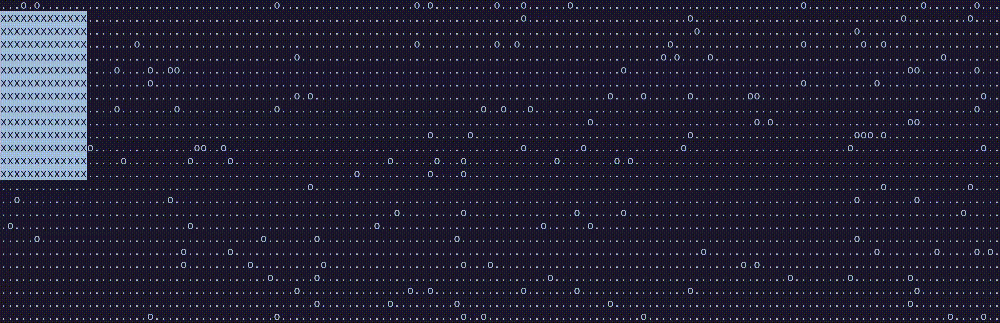

# 👋 Hnogared [![CGI Badge]](https://www.cgi.com/de/de)

### Quick introduction

Welcome to my profile page, thank you for checking it out and I hope you are having a good day !

I am currently Trainee for software development at [CGI].

There I am learning mainly frontend development with React/Vue/Typescript and backend programming with C#/.Net.

I also went to school [42], where I learned low-level programming with the languages C/C++ and the script language Bash.

---

### Skills

<table align="center">
  <tr>
    <td align="center">
      <a href="https://skillicons.dev">
        <picture>
          <source media="(prefers-color-scheme: dark)" srcset="https://skillicons.dev/icons?i=git%2Cgithub%2Cazure%2Cdocker%2Cvscode%2Cvisualstudio%2Cvim&theme=dark&perline=4"/>
          
        </picture>
      </a>
    </td>
    <td rowspan="2" align="center" valign="center">
      <a href="https://github.com/anuraghazra/github-readme-stats">
        <picture>
          <source media="(prefers-color-scheme: dark)" srcset="https://github-readme-stats.vercel.app/api/top-langs/?username=Hnogared&layout=compact&show_icons=true&title_color=fd9f02&icon_color=fd9f02&text_color=ffffff&bg_color=191921&hide_border=true"/>
          
        </picture>
        <picture>
          <source media="(prefers-color-scheme: dark)" srcset="https://github-readme-stats.vercel.app/api?username=Hnogared&title_color=fd9f02&text_color=ffffff&bg_color=191921&hide_border=true"/>
          
        </picture>
      </a>
    </td>
  </tr>
  
  <tr>
    <td align="center" valign="center">  
      <a href="https://skillicons.dev">
        <picture>
          <source media="(prefers-color-scheme: dark)" srcset="https://skillicons.dev/icons?i=c%2Ccpp%2Ccs%2Cjavascript%2Ctypescript%2Creact%2Credux%2Cvue%2Cbash%2Cpython&theme=dark&perline=4"/>
          
        </picture>
      </a>
    </td>
  </tr>
</table>

***

A fun 42 project where you write a program to find the biggest square on a map of obstacles

<!-- ************************************************************************************************** -->

[CGI Badge]: https://img.shields.io/badge/CGI%20Deutschland%20-Trainee-E31937 "CGI Deutschland Page"
[CGI]: https://www.cgi.com/de/de "CGI Deutschland Homepage"

[42]: https://42.fr/en/homepage/ "42 France Homepage"
